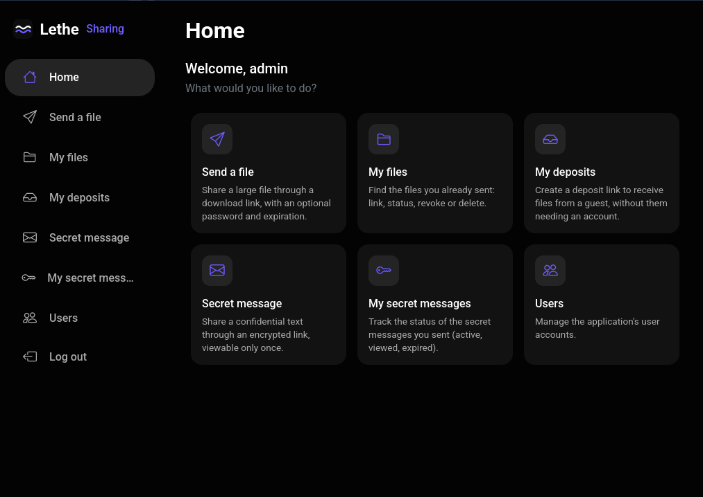
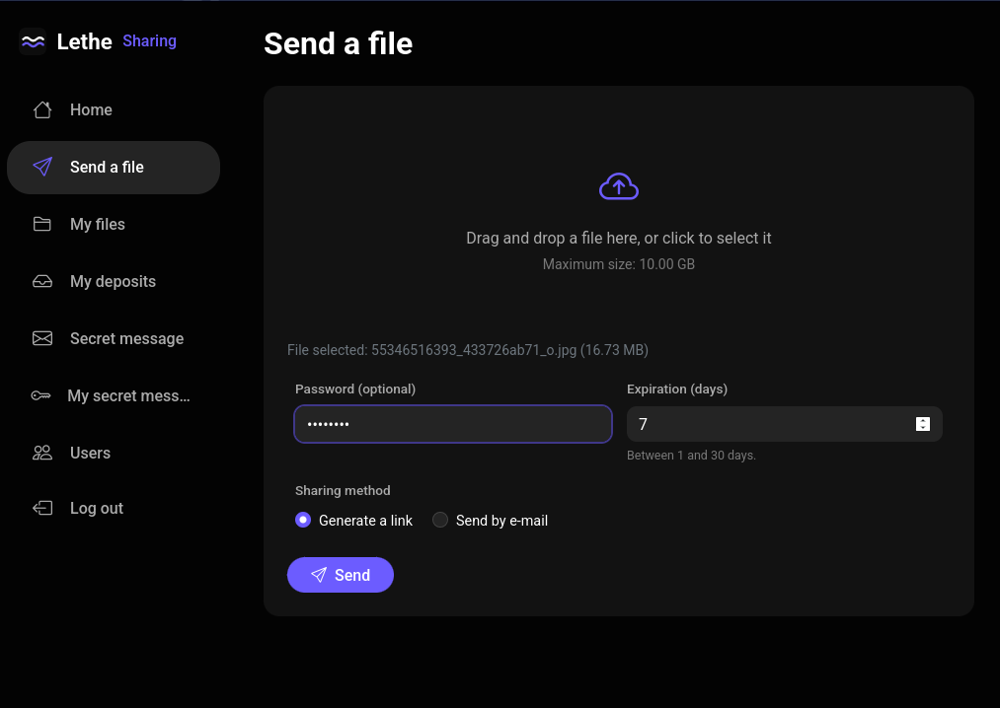
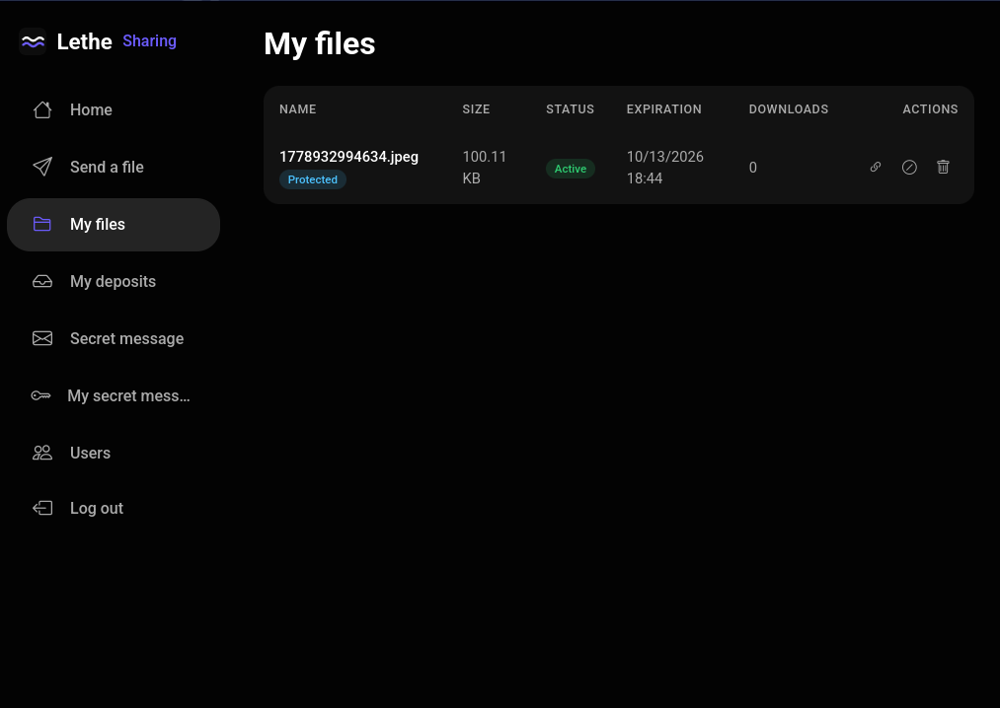
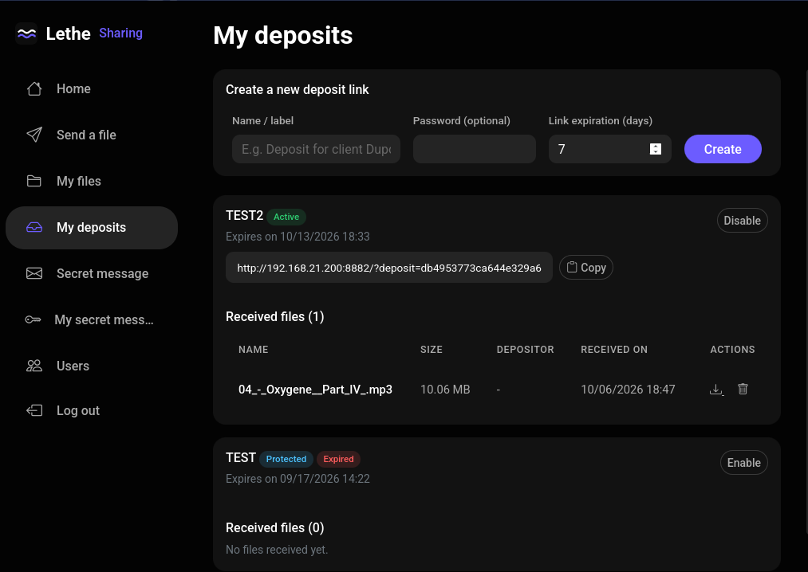
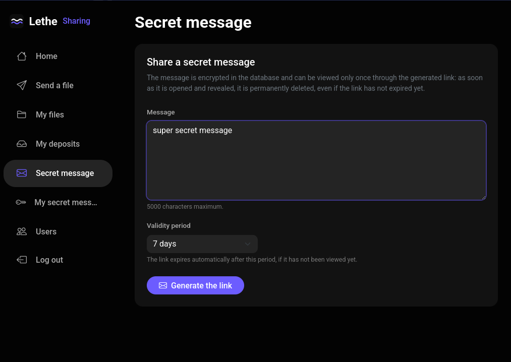
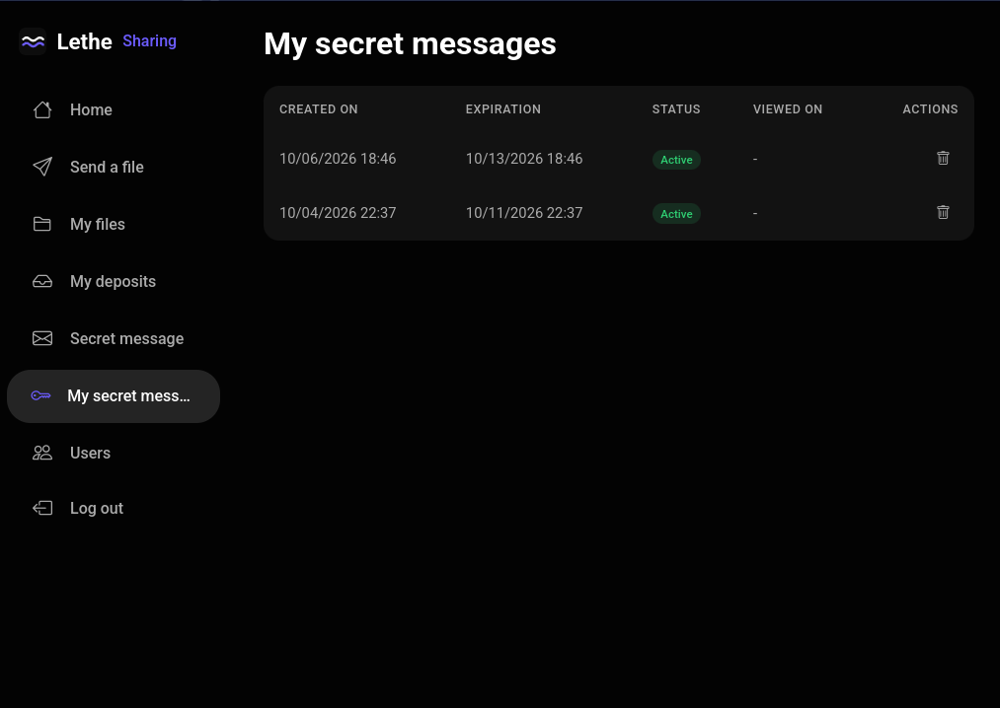
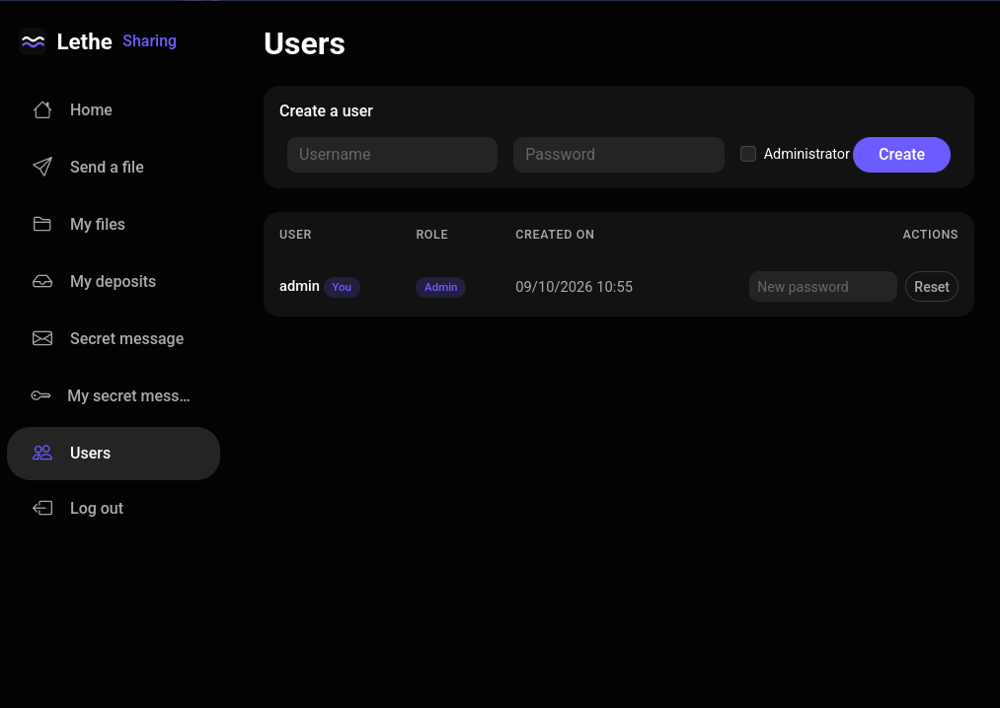
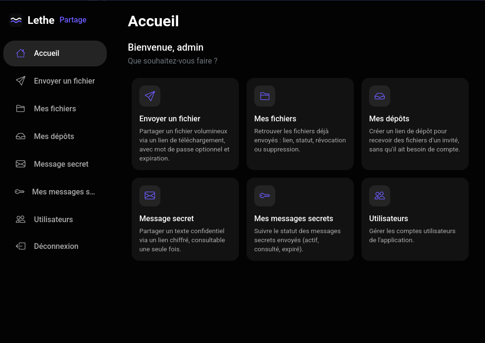

# Lethe

**Lethe** est une alternative auto-hébergée à WeTransfer : une application PHP 8+ (sans
framework ni Composer) basée sur SQLite, pour envoyer des fichiers volumineux (jusqu'à
10 Go) via un lien de téléchargement, avec protection par mot de passe optionnelle,
expiration obligatoire et envoi par e-mail. Elle propose aussi des **liens de dépôt**
permettant à des invités de vous envoyer des fichiers sans compte, et des **messages
secrets** : un texte chiffré (AES-256-GCM), partagé via un lien à usage unique et durée de
vie limitée (1, 7, 14 ou 30 jours), définitivement détruit après sa première consultation.

L'interface est une application monopage (SPA) au thème sombre : une barre latérale donne
accès aux différents outils (envoi de fichier, mes fichiers, mes dépôts, messages secrets,
administration), les données sont chargées en AJAX via une API `?action=...`. L'interface
est multilingue (anglais et français) et détectée automatiquement depuis l'en-tête
`Accept-Language` du navigateur.

## Prérequis

- PHP 8.1+ avec les extensions **pdo_sqlite**, **openssl** et **fileinfo** (et `mbstring`
  si disponible, sinon repli automatique sur `strlen`)
- Apache (avec `mod_php` ou PHP-FPM) ou Nginx + PHP-FPM
- Un canal d'envoi de mail fonctionnel : un MTA local (`sendmail`/`postfix`) pour que
  `mail()` fonctionne, ou un relais SMTP configuré dans `config.php` (voir
  [Envoi de mails](#envoi-de-mails))

## Installation

1. Copier l'ensemble du dossier `lethe/` sur le serveur.
2. **Le `DocumentRoot` (ou `root` Nginx) doit pointer vers le dossier `lethe/` lui-même**
   (le front controller `index.php` est à la racine). Les dossiers `src/`, `data/`,
   `uploads/`, `cron/` et `lang/` ainsi que le fichier `config.php` sont protégés par des
   fichiers `.htaccess` `Require all denied` (Apache) ; pour Nginx, ajouter les équivalents :
   ```nginx
   location ~ ^/(src|data|uploads|cron|lang)/ { deny all; }
   location = /config.php { deny all; }
   ```
3. Rendre les dossiers `uploads/` (et `uploads/tmp/`) et `data/` accessibles en écriture
   par l'utilisateur du serveur web :
   ```
   chown -R www-data:www-data lethe/uploads lethe/data
   chmod -R 775 lethe/uploads lethe/data
   ```
   Si SELinux est présent :
   ```
   chcon -R -t httpd_sys_rw_content_t lethe/data
   chcon -R -t httpd_sys_rw_content_t lethe/uploads
   ```
4. Ouvrir `config.php` (à la racine, hors webroot) et adapter au minimum :
   - `APP_URL` : l'URL publique de l'application (ex. `https://transfer.mondomaine.fr`) —
     laisser vide pour la détection automatique
   - `MAIL_FROM_ADDRESS` / `MAIL_FROM_NAME` : l'expéditeur des e-mails
   - `MAIL_BODY_TEMPLATE` : le corps par défaut des e-mails (l'utilisateur peut aussi le
     personnaliser à chaque envoi)
   - `MAX_FILE_SIZE`, `MIN_EXPIRATION_DAYS`, `MAX_EXPIRATION_DAYS`, `DEFAULT_EXPIRATION_DAYS`
   - le bloc `SMTP_*` si `MAIL_TRANSPORT` vaut `'smtp'`
5. Se connecter une première fois avec le compte créé automatiquement :
   - **Utilisateur : `admin`**
   - **Mot de passe : `admin`**
   - **À changer immédiatement** depuis Utilisateurs → Réinitialiser (ou directement en
     base).

La base SQLite (`data/database.sqlite`) et ses tables sont créées automatiquement au
premier accès. La clé de chiffrement des messages secrets (`data/secret.key`) est générée
au premier usage (permissions 0600).

## Configuration serveur (important pour les gros fichiers)

L'upload se fait par **tranches de 1 Mo** envoyées en AJAX, ce qui contourne la plupart
des limites classiques de PHP (`upload_max_filesize`, `post_max_size`,
`max_execution_time`). Il reste recommandé d'ajuster `php.ini` pour plus de confort :

```ini
upload_max_filesize = 16M
post_max_size = 16M
max_execution_time = 300
max_input_time = 300
memory_limit = 256M
```

Pour Nginx, augmenter la limite de taille de requête (si un proxy est utilisé) :
```nginx
client_max_body_size 20M;
```

Le téléchargement désactive lui-même les timeouts (`set_time_limit(0)`) et diffuse le
fichier par blocs de 8 Mo, donc aucune limite serveur ne bloque un fichier de 10 Go côté
téléchargement.

## Configuration

### Tâche cron

Ajouter au crontab de l'utilisateur du serveur (ex. `www-data`) :

```
0 * * * * /usr/bin/php /chemin/vers/lethe/cron/cleanup.php >> /var/log/lethe-cleanup.log 2>&1
```

Ce script (logique commune dans `src/Services/Cleanup.php`, CLI uniquement) :
- supprime du disque tout fichier partagé expiré ou révoqué (et son entrée en base),
- supprime tout fichier reçu via un lien de dépôt dont l'expiration est dépassée,
- désactive les liens de dépôt expirés,
- supprime les messages secrets expirés ou déjà consultés (par sécurité : un message
  consulté est déjà vidé de son contenu par l'application elle-même dès sa lecture ; le
  cron ne fait ici que nettoyer la ligne résiduelle),
- nettoie les fragments d'upload abandonnés depuis plus de 24 h.

### Envoi de mails

Deux modes sont disponibles dans `config.php`, via `MAIL_TRANSPORT` :

#### a) `sendmail`
Utilise la fonction native `mail()` de PHP, qui s'appuie sur le MTA local du serveur
(sendmail/postfix). Simple, mais dépend d'un MTA correctement configuré sur la machine.

#### b) `smtp`
Envoie directement les e-mails via un serveur SMTP (interne ou externe), sans dépendance
externe (client SMTP maison basé sur les sockets PHP, pas de Composer/PHPMailer requis).
Configuration dans `config.php` :

```php
define('MAIL_TRANSPORT', 'smtp');
define('SMTP_HOST', 'smtp.mondomaine.fr');
define('SMTP_PORT', 587);                 // 587 (STARTTLS), 465 (SSL implicite), 25 (non chiffré)
define('SMTP_ENCRYPTION', 'tls');         // 'tls' | 'ssl' | 'none'
define('SMTP_VERIFY_CERT', true);         // à ne désactiver que pour du dépannage
define('SMTP_USERNAME', '');
define('SMTP_PASSWORD', '');
define('SMTP_TIMEOUT', 15);
```

Si l'envoi de l'e-mail échoue, le fichier reste enregistré et son lien reste disponible
dans « Mes fichiers » (l'échec est signalé à l'utilisateur et journalisé).

Le sujet et le corps par défaut de l'e-mail sont **traduits dans la langue de
l'expéditeur** (clés `mail.subject` / `mail.body` / `mail.password_notice` dans
`lang/*.php`). Ils peuvent être surchargés dans `config.php` via `MAIL_SUBJECT` et
`MAIL_BODY_TEMPLATE` (laisser vide pour utiliser les modèles intégrés). L'utilisateur peut
aussi personnaliser le message à chaque envoi (champ « Message personnalisé »).

## Utilisation

L'interface est une application monopage avec une barre latérale. Chaque module est
présenté ci-dessous (captures dans le dossier `doc/`).

### Tableau de bord



Écran d'accueil avec accès rapide à tous les outils.

### Envoyer un fichier



Glisser-déposer ou sélectionner un fichier, choisir l'expiration (1 à 30 jours), définir
un mot de passe optionnel, et éventuellement envoyer le lien par e-mail à un destinataire
avec un message personnalisé. L'upload se fait par tranches de 1 Mo avec une barre de
progression ; à la fin, un lien de téléchargement partageable est généré.

### Mes fichiers



Liste des fichiers envoyés : nom, taille, expiration, statut et nombre de
téléchargements. Copier le lien, le révoquer (désactiver sans supprimer) ou supprimer le
fichier entièrement.

### Mes dépôts



Créer un lien de dépôt (libellé, mot de passe optionnel, expiration) et le partager :
toute personne détentrice du lien peut vous envoyer un fichier sans compte. Vous pouvez
activer/désactiver un dépôt, et télécharger ou supprimer les fichiers reçus via ce dépôt.

### Message secret



Saisir un texte confidentiel (mot de passe, clé d'API, …), choisir une durée de validité
(1, 7, 14 ou 30 jours) et obtenir un lien à usage unique. Le message est chiffré au repos
(AES-256-GCM) ; le destinataire voit un écran de confirmation avant de le révéler, et le
contenu est définitivement détruit après la première consultation.

### Mes messages secrets



Suivre les messages secrets envoyés : actifs, consultés ou expirés. Suppression à tout
moment.

### Utilisateurs (admin)



Module réservé à l'administrateur : créer des utilisateurs, les supprimer et
réinitialiser leurs mots de passe.

### Interface multilingue

L'interface (menus, pages publiques, messages de l'API, e-mails par défaut) est disponible
en anglais et en français et est **détectée automatiquement depuis l'en-tête
`Accept-Language` du navigateur** — aucun paramètre d'URL ni cookie n'est nécessaire. Les
traductions vivent dans `lang/<code>.php` (l'anglais est la source de vérité et la langue
de repli).



## Développement assisté par IA

Ce projet a été développé avec l'assistance d'un modèle d'IA, **Qwen3.8 27B, exécuté en
local** :
- l'**interface multilingue** (l'application a initialement été développée uniquement en
  français) a été réalisée avec son assistance ;
- le **style CSS** de l'application a été produit avec son assistance, en suivant des
  instructions précises.
